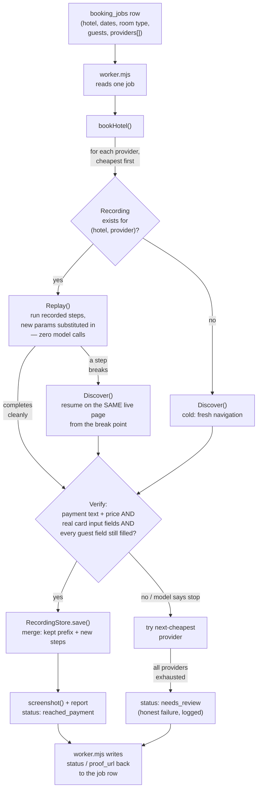

# Hotel Booking Agent — Approach

Prepared for review (Jimmy Nguyen). Covers: tech stack, data-flow diagram, a concrete demo case (input → output), and known limitations / what would need to be enhanced for production use.

For the full design rationale, live-verified site-specific fixes, and test coverage, see `README.md` in this same folder — this document is the higher-level summary.

---

## 1. Tech stack

| Layer | Choice | Why |
|---|---|---|
| Language / runtime | Node.js ≥ 22, plain ES modules (no bundler/framework) | Small surface area, no build step, fast iteration for a one-week PoC |
| Browser automation | [Playwright](https://playwright.dev/) driven through [patchright](https://github.com/Kaliiiiiiiiii-Vinyzu/patchright) | patchright is a stealth-patched Chromium/Chrome driver — it doesn't set `navigator.webdriver` or other stock-Playwright automation fingerprints that real anti-bot systems (Akamai/DataDome/PerimeterX-class) check for |
| Browser binary | Real Google Chrome (`channel: 'chrome'`), not the bundled open-source Chromium | Live-verified: headless *and* the bundled Chromium build each independently triggered bot-detection walls on at least one real OTA; the real Chrome binary, run headed, did not |
| AI model | Claude Sonnet 5 (`claude-sonnet-5`) via the Anthropic Messages API | One model call per browser step — given a screenshot (vision) plus a structured list of the page's interactive elements (DOM/accessibility grounding) — decides the next action as a single JSON object |
| Persistence (recordings) | Flat JSON files on disk (`recordings/`) | A recording is a short, human-readable list of steps; no database features needed |
| Persistence (job queue) | SQLite (`better-sqlite3`) locally, behind a 3-function interface (`getJob`/`insertJob`/`writeJobResult`) matching the real `booking_jobs` schema | Swappable for TakeMeTo's staging Postgres later with no code change above the interface |
| Testing | Node's built-in `node:test` runner + a tiny local HTTP fixture (not a real site) | Zero extra dependency; fast, deterministic, no network |

No frontend, no queue-polling service, no framework — this is a library (`bookHotel(...)`) plus two thin CLI entry points (`src/cli/run.mjs` for direct/manual runs, `src/cli/worker.mjs` for the job-queue pattern).

---

## 2. Data flow



Two loops worth calling out explicitly:

- **The per-step Discover loop** (inside the `Discover` box above): screenshot + numbered element list → one Claude call → one browser action (click/fill/select/scroll/wait) → repeat, until the page verifiably looks like payment or the model gives up.
- **The per-provider fallback loop** (the outer loop in `bookHotel`): try providers cheapest-first; a failure at any stage (no availability, drift, structure not recognized) moves to the next provider, never aborts the whole job.

---

## 3. Demo case: input → output

One concrete, real run (major-OTA category, Agoda). This is what actually happened, not a hypothetical.

**Data preparation.** No synthetic guest data is invented per-run — the agent always uses the same fixed, clearly-fictional guest identity (`Max Mustermann`, a placeholder email/phone), since the task explicitly stops before payment and this data is never read from the job row. What *is* per-run is the booking intent: hotel name, dates, room type preference, guest count, and the provider list (sorted cheapest-first, matching the real `providers` field shape from SerpApi).

**Input** (`providers.json` — one entry here, but the real shape supports several, tried in order):

```json
[
  { "name": "Agoda", "homepage": "https://www.agoda.com", "pricePerNight": 6367096 }
]
```

Invocation:

```bash
node src/cli/run.mjs \
  --hotel "Sofitel Mumbai BKC" \
  --checkin 2026-10-15 \
  --checkout 2026-10-18 \
  --guests 2 \
  --providers providers.json
```

**What happens:** `bookHotel()` finds no existing recording for (Sofitel Mumbai BKC, Agoda), so it runs Discover cold. Playwright opens a real, headed Chrome window, warms a session on Agoda's own homepage, then types the hotel name into Agoda's own search box (**no deep link, no hardcoded hotel/room IDs** — this is what makes the major-OTA generalization claim real rather than hardcoded), picks the matching autocomplete suggestion, sets dates via the calendar, selects a room, and fills the guest-details form with the fixed fictional identity. Each step is one Claude call; the loop stops the instant the *program* (not the model's own opinion) confirms it's on a genuine payment page with every required field still filled.

**Output** (the JSON `bookHotel()`/the CLI returns):

```json
{
  "status": "reached_payment",
  "provider": "Agoda",
  "proof": "proof/Agoda_1788753743062.png",
  "attempts": [
    { "provider": "Agoda", "success": true, "why": "payment", "tookMs": 89505, "costUsd": 0.459, "replayed": false }
  ],
  "tookMs": 89505,
  "costUsd": 0.459
}
```

Alongside that JSON: a real screenshot (`proof/Agoda_1788753743062.png`) of Agoda's actual "Payment information" page — card holder name auto-filled from the guest details already entered, card number/expiry/CVV fields correctly present but empty — and a saved recording (`recordings/sofitel_mumbai_bkc__agoda.json`) of every step taken, tagged by which input field each one filled. A second run for the *same* hotel replays that recording directly instead of asking the model anything, substituting in whatever new dates/room type were requested, and only calls the model again for the specific step(s) that changed or genuinely broke.

The other two required categories (a smaller/newer OTA — Traveloka; a hotel's own booking site — Mari Jean Hotel via its Mews booking engine) went through the identical `bookHotel()` path with no code branching per category — the only difference is which URL `providers.json` points at.

---

## 4. Known limitations / what needs enhancing before production

Listed honestly, in the same spirit as the project's own "honest failure log" — these are real, live-discovered gaps, not hypothetical caveats.

- **Field format/validation isn't checked, only field emptiness.** The final Mews proof run reached a genuine payment page with all four guest fields non-empty (a real, programmatic success) - but the proof screenshot itself shows a live validation error on the phone field ("Select the country code and enter a valid number"), since the fictional phone number used wasn't in a format the site's own validation accepts for its detected country context. `requiredFieldsFilled()`/`hasEmptyRequiredGuestField()` only verify fields hold *some* non-empty value, not that the site's own validation rules accept it - a distinct, deeper question from "was this field even attempted." A generic check for `aria-invalid`/visible error text near required fields is the natural next step; not built yet, flagged honestly instead of hidden. See README's "Mews-specific fixes" section for the full chain of six real bugs this category surfaced.
- **Multi-month calendar navigation is fragile.** When a requested date change crosses into a month the calendar isn't already showing, the model has repeatedly gotten confused mid-navigation (re-clicking a date it already set, occasionally producing malformed output). Same-month date changes work; a genuinely robust multi-month date-picker strategy (or a deterministic "click next-month N times" helper instead of relying on the model to count) is still needed.
- **Replay doesn't yet work for iframe-embedded booking widgets.** Element detection was fixed this pass to look inside iframes (some sites — Mews-powered ones especially — render their *entire* booking flow inside a same-page iframe), so Discover now interacts with these reliably. But a saved recording only stores `role`/`name`, not *which frame* the element was in — so replaying such a recording would need the same frame-search added to `replay.mjs` that `discover.mjs` now has. Not yet done.
- **Cross-hotel reuse is unimplemented (deliberately, this round).** A recording is scoped to one (hotel, site) pair. Search and guest-detail steps would likely generalize to a different hotel on the same site for free (they're tagged by field, not literal value); room selection would not, since it's a hardcoded click on that hotel's own room names. Two concrete paths forward are written up in `README.md`'s own "Cross-hotel reuse" section, neither built yet.
- **Guest-count substitution is a nice-to-have, not guaranteed.** Dates and room type are substitutable in a recording; a different party size touches a stepper control that isn't currently tracked the same way.
- **The payment-processor allowlist needs ongoing upkeep.** `verify.mjs` recognizes real payment providers (Stripe, Adyen, PayPal, Datatrans, etc.) plus a URL-content heuristic (`/payment/`, "securefield", "tokenize") as a safety net — but a genuinely novel processor with an unusual URL shape could still slip past both, silently under-reporting success the way Datatrans initially did until fixed live this pass.
- **No CAPTCHA solving, by design.** A CAPTCHA is treated as an ordinary provider failure (falls through to the next-cheapest). Acceptable for a PoC per the task's own framing of "the last 1–2% can stay human," not acceptable at scale without a real answer.
- **Cost and latency are real, not simulated.** A cold Discover run currently costs roughly $0.25–$1.10 in Claude API usage and 1–4 minutes wall-clock, depending on how many interstitials/popups a site throws up. Fine for a PoC; would need real budget/latency planning for production volume.
- **The job store is local SQLite, not TakeMeTo's actual staging Postgres.** The interface (`getJob`/`insertJob`/`writeJobResult`) is intentionally the only thing calling code touches, so swapping the backend should be a one-file change — but it hasn't been tested against the real schema/credentials yet, since those weren't available during this build.
- **No queue semantics beyond single-row read/write.** No polling loop, no locking/concurrency handling, no retry-on-crash, no kill-switch — explicitly out of scope for this round (see README's "Out of scope" note), but real requirements for an always-on production worker.
- **Reliability numbers come from a small number of live runs**, not a statistically meaningful sample. Each real site (Agoda, Traveloka, Mews-based sites) has its own quirks discovered through live testing; a genuinely new, unseen hotel/provider combination should be expected to surface new site-specific issues the way each of these three did.
